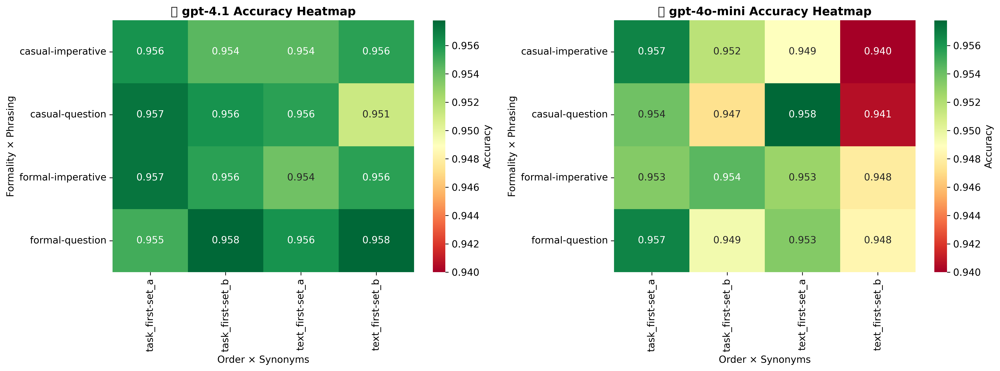
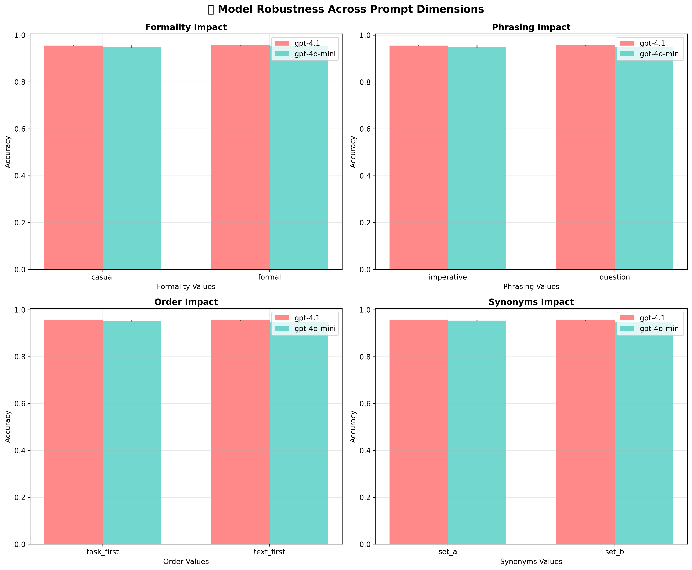
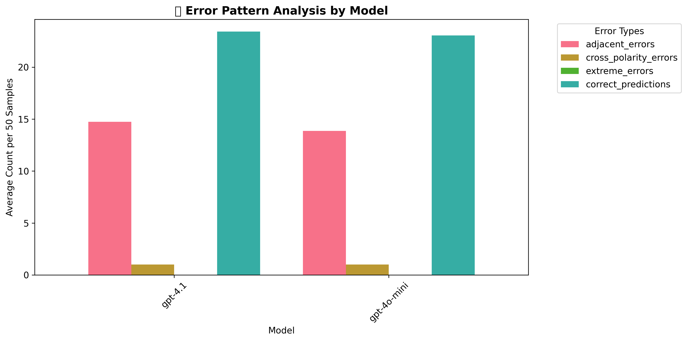

# Prompt Perturbation Robustness Testing for Large Language Models

**CEU MSBA Deep Learning Final Assignment**  
*Author: Istvan Peter Jaray*  
*Instructor: Professor Rubia Emi*

## Executive Summary

This study investigates the robustness of GPT-4.1 and GPT-4o-mini when subjected to systematic prompt variations in sentiment classification tasks. Through comprehensive experimentation across 16 baseline prompt variants and 2 context enhancement strategies for each model, I demonstrate that model capability significantly outweighs prompt optimization sophistication in determining performance reliability when using current frontier models of OpenAI.

### Technical Note

*The experimental pipeline includes full support for local Ollama model evaluation (e.g., Qwen, Mistral, LLaMA variants) through flexible model architecture. However, due to time constraints, the focus remains on OpenAI model comparison as a foundation for future research.*

## Research Question & Experimental Design

**"How robust are foundation models when prompts are slightly modified?"**

I conducted controlled experiments using the Stanford Sentiment Treebank v5 (SST-5) dataset for 5-class sentiment classification (Very Negative, Negative, Neutral, Positive, Very Positive) on 50 balanced test samples. The experimental design employed a 2×2×2×2 factorial structure across four dimensions:

- **Formality**: Formal vs Casual language register
- **Phrasing**: Imperative vs Question format  
- **Order**: Task-first vs Text-first instruction placement
- **Synonyms**: Set A ("analyze", "sentiment", "classify") vs Set B ("evaluate", "emotion", "categorize")

This systematic approach generated 16 baseline prompt variants. Additionally, I tested context enhancement through a 2×2 design examining prefix and suffix positioning of few-shot examples across the two best-performing baseline variants.

**Ex-ante Hypothesis**: Based on traditional NLP conventions, formal + question + task-first + Set A combinations were expected to perform best, employing precise technical terminology and questioning format for careful analysis.

### Evaluation Metrics

**1. MSE-Based Custom Accuracy**
The primary metric employs Mean Squared Error calculation with ordinal encoding that emphasizes polarity preservation over intensity precision:
- Very Negative = -3
- Negative = -2  
- Neutral = 0
- Positive = 2
- Very Positive = 3

This encoding structure penalizes cross-polarity errors (positive ↔ negative) more severely than adjacent category errors (e.g., Negative ↔ Very Negative), reflecting real-world deployment priorities where sentiment direction matters more than precise intensity discrimination.

**2. Group Consistency**
Group consistency measures prediction agreement across prompt variants within each model. For each test sample, I calculate the percentage of variants that agree on the most frequent prediction, then average this across all test samples. This metric quantifies model stability independent of ground truth accuracy, providing insight into deployment reliability across prompt formulations.

**3. Weighted Index**
A composite metric combining accuracy and consistency: 0.7 × accuracy + 0.3 × consistency, emphasizing accuracy while accounting for stability across variations.

## Performance Analysis

### Model Performance Summary

|                      | custom_accuracy_mean | custom_accuracy_std | custom_accuracy_min | custom_accuracy_max | model_consistency_mean | weighted_index_mean | weighted_index_std | weighted_index_min | weighted_index_max |
|:---------------------|:---------------------|:--------------------|:--------------------|:--------------------|:-----------------------|:--------------------|:-------------------|:-------------------|:-------------------|
| gpt-4.1              | 0.968                | 0.007               | 0.952               | 0.974               | 0.955                  | 0.964               | 0.005              | 0.952              | 0.97               |
| gpt-4o-mini          | 0.952                | 0.013               | 0.928               | 0.976               | 0.896                  | 0.936               | 0.009              | 0.918              | 0.951              |

GPT-4.1 demonstrates superior performance across both accuracy (μ=0.968 vs 0.952) and consistency (0.955 vs 0.896) metrics, with notably lower variance (σ=0.007 vs 0.013), indicating robust performance across prompt variations.

### Best and Worst Performing Combinations

#### Top 5 Performers
| model       | variant_id | formality | phrasing | order      | synonyms | custom_accuracy | weighted_index |
|:------------|:-----------|:----------|:---------|:-----------|:---------|:----------------|:---------------|
| gpt-4o-mini | v15        | casual    | question | text_first | set_a    | 0.976           | 0.951          |
| gpt-4.1     | v11        | casual    | imperative | text_first | set_a    | 0.974           | 0.97           |
| gpt-4.1     | v15        | casual    | question | text_first | set_a    | 0.974           | 0.97           |
| gpt-4.1     | v3         | formal    | imperative | text_first | set_a    | 0.974           | 0.97           |
| gpt-4.1     | v7         | formal    | question | text_first | set_a    | 0.974           | 0.97           |

#### Bottom 5 Performers
| model       | variant_id | formality | phrasing | order      | synonyms | custom_accuracy | weighted_index |
|:------------|:-----------|:----------|:---------|:-----------|:---------|:----------------|:---------------|
| gpt-4o-mini | v10        | casual    | imperative | task_first | set_b    | 0.928           | 0.918          |
| gpt-4o-mini | v6         | formal    | question | task_first | set_b    | 0.936           | 0.924          |
| gpt-4o-mini | v14        | casual    | question | task_first | set_b    | 0.936           | 0.924          |
| gpt-4o-mini | v2         | formal    | imperative | task_first | set_b    | 0.942           | 0.928          |
| gpt-4o-mini | v12        | casual    | imperative | text_first | set_b    | 0.942           | 0.928          |

Analysis reveals that GPT-4o-mini exhibits sensitivity to Set B synonyms and task-first ordering, while GPT-4.1 maintains consistent performance across dimensional variations.

## Statistical Analysis

### Dimensional Impact Testing

| model       | dimension | value1     | value2     | acc_mean_1 | acc_mean_2 | acc_std_1 | acc_std_2 | acc_p_value | acc_significant |
|:------------|:----------|:-----------|:-----------|:-----------|:-----------|:----------|:----------|:------------|:----------------|
| gpt-4.1     | formality | casual     | formal     | 0.968      | 0.9685     | 0.0075    | 0.0069    | 0.7795      |                 |
| gpt-4.1     | order     | task_first | text_first | 0.9654     | 0.9715     | 0.0069    | 0.0        | 0.2162      |                 |
| gpt-4.1     | phrasing  | imperative | question   | 0.9685     | 0.9684     | 0.0069    | 0.0075    | 0.9822      |                 |
| gpt-4.1     | synonyms  | set_a      | set_b      | 0.9684     | 0.9684     | 0.0072    | 0.0072    | 1.0         |                 |
| gpt-4o-mini | formality | casual     | formal     | 0.9505     | 0.9535     | 0.0154    | 0.011     | 0.6421      |                 |
| gpt-4o-mini | order     | task_first | text_first | 0.9495     | 0.9545     | 0.0115    | 0.0139    | 0.4303      |                 |
| gpt-4o-mini | phrasing  | imperative | question   | 0.951      | 0.953      | 0.0127    | 0.0137    | 0.7516      |                 |
| gpt-4o-mini | synonyms  | set_a      | set_b      | 0.9565     | 0.9475     | 0.0133    | 0.0067    | 0.0068      | ✓               |

**Important finding**: Statistical significance testing reveals that only GPT-4o-mini exhibits sensitivity to synonym choice (p=0.0068), where Set A terminology outperforms Set B alternatives. GPT-4.1 demonstrates complete robustness across all dimensional variations (all p-values > 0.05).

## Error Analysis and Context Enhancement

### Error Pattern Distribution

|         | adjacent_errors_mean | adjacent_errors_std | cross_polarity_errors_mean | cross_polarity_errors_std | extreme_errors_mean | extreme_errors_std | correct_predictions_mean | correct_predictions_std |
|:--------|:---------------------|:--------------------|:---------------------------|:--------------------------|:--------------------|:-------------------|:-------------------------|:------------------------|
| gpt-4.1 | 1.56                 | 0.35                | 0.0                        | 0.0                       | 0.0                 | 0.0                | 48.44                    | 0.35                    |
| gpt-4o-mini | 2.41             | 0.67                | 0.0                        | 0.0                       | 0.0                 | 0.0                | 47.59                    | 0.67                    |

Both models demonstrate strong fundamental sentiment understanding with zero extreme errors (Very Negative ↔ Very Positive) and zero cross-polarity confusion. Error patterns consist exclusively of adjacent category misclassifications, indicating that failure modes remain within reasonable intensity boundaries.

### Context Enhancement Results

Context enhancement employed a 2×2 experimental design testing prefix and suffix positioning of carefully selected few-shot examples across the best-performing baseline variants for each model. Examples were selected using length diversity (short/medium/long) and TF-IDF cosine dissimilarity optimization, ensuring semantic diversity across 15 examples (3 per sentiment class) with approximately 25% token overhead.

| model       | enhanced_variant | context_position | accuracy_improvement | consistency_improvement | weighted_improvement |
|:------------|:-----------------|:-----------------|:---------------------|:------------------------|:---------------------|
| gpt-4.1     | v11_prefix       | prefix           | -0.002               | -0.029                  | -0.011               |
| gpt-4.1     | v11_suffix       | suffix           | -0.006               | -0.057                  | -0.023               |
| gpt-4o-mini | v15_prefix       | prefix           | -0.008               | 0.02                   | 0.001                |
| gpt-4o-mini | v15_suffix       | suffix           | -0.01                | 0.002                  | -0.005               |

Surprisingly, context enhancement resulted in negative performance impact across most metrics. This finding challenges conventional few-shot learning assumptions and suggests that modern large language models may possess sufficient inherent capabilities for well-defined classification tasks, making additional examples potentially counterproductive. Another possibility is that this specific dataset contains no domain-specific sentiment, in which case we could see further improvements.

### Context Examples Distribution

|        | Negative | Neutral | Positive | Very Negative | Very Positive |
|:-------|:---------|:--------|:---------|:--------------|:--------------|
| long   | 1        | 1       | 1        | 1             | 1             |
| medium | 1        | 1       | 1        | 1             | 1             |
| short  | 1        | 1       | 1        | 1             | 1             |

## Key Findings and Practical Implications

### Summary of Results

| Metric | Value |
|:-------|:------|
| Best Overall Model | gpt-4.1 |
| Best Overall Variant | v11 |
| Most Stable Dimension | order |
| Least Stable Dimension | phrasing |
| Context Enhancement Effect | -0.006 avg accuracy change |

### Deployment Recommendations

**1. Model Selection Priority**: GPT-4.1's consistent superiority across accuracy and robustness metrics demonstrates that model capability investment yields greater returns than extensive prompt optimization efforts. However, the accuracy of GPT-4o-mini is only slightly lower, but less costly.

**2. Prompt Engineering Guidelines**:
- Employ Set A terminology ("analyze", "sentiment", "classify") over casual alternatives
- Question format demonstrates marginal advantage over imperative instructions
- Instruction order shows minimal impact on performance  
- Maintain formal register and technical precision

**3. Context Strategy**: For well-defined classification tasks, avoid few-shot examples as they may degrade performance in sufficiently capable models.

**4. Production Implementation**: Select the most capable model available, implement clear prompts with technical vocabulary, and prioritize simplicity over complexity in prompt design.

## Conclusion

This experimental analysis demonstrates that modern large language models, particularly GPT-4.1, exhibit substantial robustness to prompt formulation variations. The primary insight is that model capability significantly outweighs prompt engineering sophistication in determining system reliability.

The counterintuitive finding that context enhancement degrades performance suggests an evolution in optimal prompting strategies, where traditional few-shot approaches may become obsolete for sophisticated models. These results provide evidence-based guidance for practitioners implementing sentiment classification systems in production environments.

*This research establishes a methodological framework for robustness evaluation and offers practical recommendations for deploying large language models in classification applications.* 