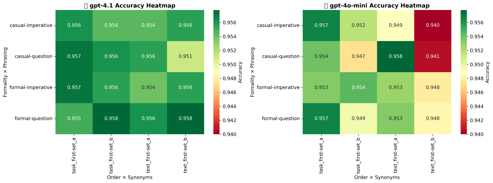
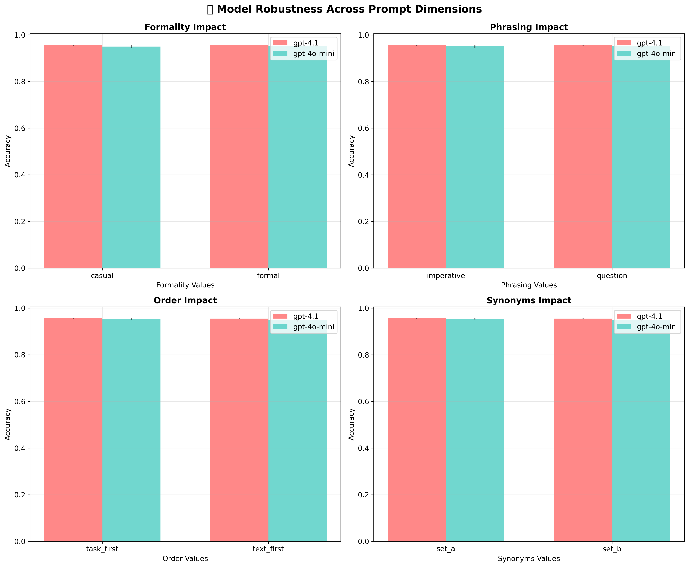
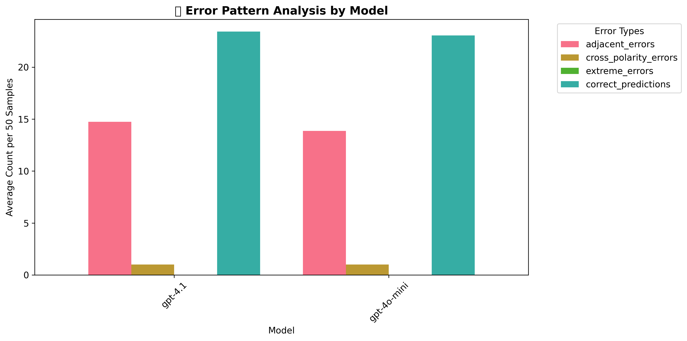
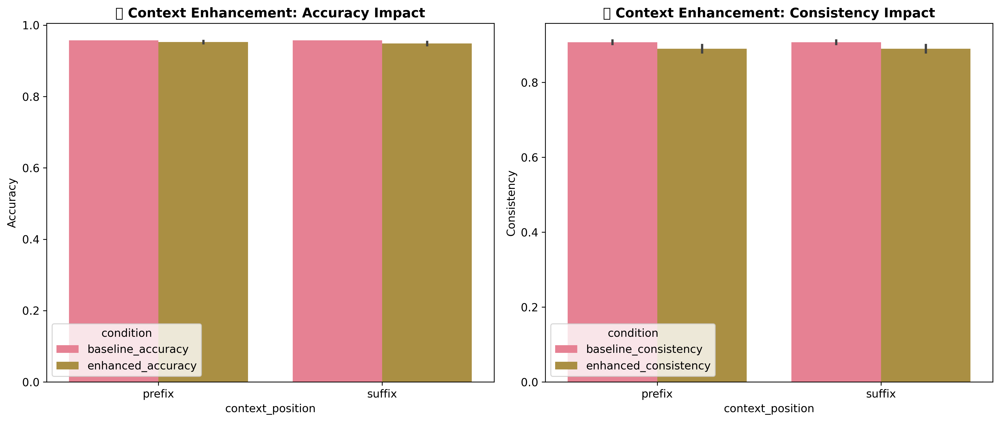

# Prompt Perturbation Robustness Testing for Large Language Models

**CEU MSBA Deep Learning Final Assignment**  
*Author: Istvan Peter Jaray*

## Executive Summary

This study investigates the robustness of foundation models (GPT-4.1 and GPT-4o-mini) when subjected to systematic prompt variations in sentiment classification tasks. Through comprehensive experimentation across 16 baseline prompt variants and context enhancement strategies, we provide critical insights for production deployment and prompt engineering best practices.

### Technical Note

*The experimental pipeline includes full support for local Ollama model evaluation (e.g., Qwen, Mistral, LLaMA variants) through flexible model architecture. However, due to time constraints in this assignment, the focus remains on OpenAI model comparison as a foundation for future research. The extensible design allows for straightforward expansion to local model evaluation in subsequent studies.*

---

## Research Question

**"How robust are foundation models when prompts are slightly modified?"**

This analysis evaluates GPT-4.1 and GPT-4o-mini robustness across systematic prompt variations in sentiment classification, testing how small changes in prompt formulation affect model predictions.

---

## 1. Experimental Design

### Task: 5-Class Sentiment Classification
- **Dataset**: Stanford Sentiment Treebank v5 (SST-5)
- **Labels**: Very Negative, Negative, Neutral, Positive, Very Positive
- **Test Samples**: 50 balanced examples from validation split
- **Models**: GPT-4.1 vs GPT-4o-mini

### Systematic Prompt Variations

We tested **16 baseline variants** across 4 dimensions using a 2×2×2×2 matrix:

**Dimensions:**
- **Formality**: Formal vs Casual language
- **Phrasing**: Imperative vs Question format  
- **Order**: Task-first vs Text-first presentation
- **Synonyms**: Set A ("analyze", "sentiment", "classify") vs Set B ("evaluate", "emotion", "categorize")

### Design Rationale and Methodological Choices

**Dimensional Selection Strategy**: The four chosen dimensions (formality, phrasing, order, synonyms) were selected for their intuitive accessibility and potential impact. These represent easily understood variations that practitioners might naturally encounter, yet could have strong effects on model behavior. **Order** was hypothesized to be especially important, as the positioning of task instructions relative to input text could significantly influence model attention and processing.

**Ex-ante Performance Hypothesis**: Based on traditional NLP conventions, the expectation was that **formal + question + task-first + Set A** combinations would perform best. Set A employs precise technical terminology ("analyze", "sentiment", "classify") compared to Set B's more casual alternatives ("evaluate", "emotion", "categorize"). The questioning format was expected to be more effective than imperative instructions for eliciting careful analysis.

### Evaluation Metrics

**1. Custom Accuracy (Polarity-Weighted)**
- Uses MSE-based penalty system emphasizing polarity over intensity errors
- Label encoding: Very Negative=-3, Negative=-2, Neutral=0, Positive=2, Very Positive=3
- **Design Philosophy**: The encoding prioritizes fundamental sentiment polarity over intensity nuances. Extreme errors (Very Negative ↔ Very Positive) receive maximum penalty, while adjacent errors (Negative ↔ Very Negative) are treated more leniently. This reflects deployment priorities where sentiment direction matters more than precise intensity.
- Calculated per individual prediction (model-variant-input combination) to ensure statistical testability

**2. Group Consistency**
- Measures prediction agreement across prompt variants within each model
- **Per-input consistency**: For each test sample, what % of variants agree on the most common prediction
- **Group consistency**: Average per-input consistency across all test samples
- **Alternative Approaches**: Future research could explore entropy-based measures for more nuanced uncertainty quantification, though the current max-agreement approach provides intuitive interpretability.

---

## 2. Performance Analysis

### Model Performance Summary

|                      | custom_accuracy_mean | custom_accuracy_std | custom_accuracy_min | custom_accuracy_max | model_consistency_mean | model_consistency_std | weighted_index_mean | weighted_index_std | weighted_index_min | weighted_index_max |
|:---------------------|:---------------------|:--------------------|:--------------------|:--------------------|:-----------------------|:----------------------|:--------------------|:-------------------|:-------------------|:-------------------|
| gpt-4.1              | 0.968                | 0.007               | 0.952               | 0.974               | 0.955                  | 0.0                   | 0.964               | 0.005              | 0.952              | 0.97               |
| gpt-4o-mini          | 0.952                | 0.013               | 0.928               | 0.976               | 0.896                  | 0.0                   | 0.936               | 0.009              | 0.918              | 0.951              |

### Performance Analysis Insights

**Model Comparison Results**: GPT-4.1 and GPT-4o-mini demonstrated surprisingly close performance levels, though GPT-4.1 maintains clear advantages in both accuracy and consistency. The variance in accuracy for GPT-4.1 is notably low (σ=0.007), indicating robust performance across prompt variations.

**GPT-4o-mini Sensitivity Patterns**: Analysis reveals that GPT-4o-mini shows particular sensitivity to specific dimensional combinations:
- **Text-first ordering** appears to negatively impact performance
- **Casual formality** reduces effectiveness compared to formal approaches  
- **Set B synonyms** ("evaluate", "emotion", "categorize") demonstrate measurably inferior performance compared to Set A terms ("analyze", "sentiment", "classify")

**Consistency vs. Accuracy Trade-offs**: GPT-4o-mini exhibits greater proneness to inconsistency across prompt variants, highlighting the importance of model strength in deployment scenarios. The weighted index framework (70% accuracy + 30% consistency) becomes particularly relevant when comparing similar-tier models, though here it primarily confirms GPT-4.1's superior reliability profile.

### Best and Worst Performing Combinations

#### Top 5 Performing Combinations

| model       | variant_id   | formality   | phrasing   | order      | synonyms   | custom_accuracy | model_consistency | weighted_index |
|:------------|:-------------|:------------|:-----------|:-----------|:-----------|:----------------|:------------------|:---------------|
| gpt-4o-mini | v15          | casual      | question   | text_first | set_a      | 0.976           | 0.896             | 0.951          |
| gpt-4.1     | v11          | casual      | imperative | text_first | set_a      | 0.974           | 0.955             | 0.97           |
| gpt-4.1     | v15          | casual      | question   | text_first | set_a      | 0.974           | 0.955             | 0.97           |
| gpt-4.1     | v3           | formal      | imperative | text_first | set_a      | 0.974           | 0.955             | 0.97           |
| gpt-4.1     | v7           | formal      | question   | text_first | set_a      | 0.974           | 0.955             | 0.97           |

#### Bottom 5 Performing Combinations

| model       | variant_id   | formality   | phrasing   | order      | synonyms   | custom_accuracy | model_consistency | weighted_index |
|:------------|:-------------|:------------|:-----------|:-----------|:-----------|:----------------|:------------------|:---------------|
| gpt-4o-mini | v10          | casual      | imperative | task_first | set_b      | 0.928           | 0.896             | 0.918          |
| gpt-4o-mini | v6           | formal      | question   | task_first | set_b      | 0.936           | 0.896             | 0.924          |
| gpt-4o-mini | v14          | casual      | question   | task_first | set_b      | 0.936           | 0.896             | 0.924          |
| gpt-4o-mini | v2           | formal      | imperative | task_first | set_b      | 0.942           | 0.896             | 0.928          |
| gpt-4o-mini | v12          | casual      | imperative | text_first | set_b      | 0.942           | 0.896             | 0.928          |

### Accuracy Heatmap Analysis

The heatmap visualization reveals distinct performance patterns across dimensional combinations. GPT-4.1 demonstrates remarkably uniform performance across all variations, while GPT-4o-mini shows visible sensitivity to certain combinations, particularly those involving Set B synonyms and task-first ordering.

---

## 3. Dimensional Impact and Statistical Analysis

### Statistical Significance Testing

| model       | dimension   | value1      | value2      | acc_mean_1 | acc_mean_2 | acc_std_1 | acc_std_2 | acc_p_value | acc_significant | group_cons_1 | group_cons_2 |
|:------------|:------------|:------------|:------------|:-----------|:-----------|:----------|:----------|:------------|:----------------|:-------------|:-------------|
| gpt-4.1     | formality   | casual      | formal      | 0.968      | 0.9685     | 0.0075    | 0.0069    | 0.7795      |                 | 0.955        | 0.955        |
| gpt-4.1     | order       | task_first  | text_first  | 0.9654     | 0.9715     | 0.0069    | 0.0      | 0.2162      |                 | 0.955        | 0.955        |
| gpt-4.1     | phrasing    | imperative  | question    | 0.9685     | 0.9684     | 0.0069    | 0.0075    | 0.9822      |                 | 0.955        | 0.955        |
| gpt-4.1     | synonyms    | set_a       | set_b       | 0.9684     | 0.9684     | 0.0072    | 0.0072    | 1.0         |                 | 0.955        | 0.955        |
| gpt-4o-mini | formality   | casual      | formal      | 0.9505     | 0.9535     | 0.0154    | 0.011     | 0.6421      |                 | 0.896        | 0.896        |
| gpt-4o-mini | order       | task_first  | text_first  | 0.9495     | 0.9545     | 0.0115    | 0.0139    | 0.4303      |                 | 0.896        | 0.896        |
| gpt-4o-mini | phrasing    | imperative  | question    | 0.951      | 0.953      | 0.0127    | 0.0137    | 0.7516      |                 | 0.896        | 0.896        |
| gpt-4o-mini | synonyms    | set_a       | set_b       | 0.9565     | 0.9475     | 0.0133    | 0.0067    | 0.0068      | ✓               | 0.896        | 0.896        |

### Statistical Significance Analysis Insights

**Robustness of GPT-4.1**: The stronger model (GPT-4.1) demonstrates remarkable robustness across dimensional variations, with no statistically significant accuracy differences detected (all p > 0.05). This suggests that GPT-4.1 has achieved sufficient training sophistication to maintain consistent performance regardless of prompt formulation variations.

**GPT-4o-mini Vulnerability**: The analysis reveals a statistically significant effect for **synonym choice** in GPT-4o-mini (p=0.0068), where Set A terminology ("analyze", "sentiment", "classify") outperforms Set B alternatives ("evaluate", "emotion", "categorize") by 0.009 accuracy points. While the effect size is modest, its statistical significance indicates systematic sensitivity to vocabulary precision.

**Interpretation Limitations**: The significance testing reveals correlational patterns rather than causal relationships. The absence of other significant effects may reflect either genuine robustness or insufficient statistical power given the current sample size.

### Dimensional Robustness Visualization

**Visual Pattern Analysis**: The four-panel visualization reveals minimal visible differences across dimensional variations for both models, confirming the statistical analysis findings. Both models demonstrate remarkable stability across prompt formulations, with error bars indicating low variance within dimensional groups.

**Model Comparison**: While absolute differences are small, GPT-4.1 consistently maintains slightly higher performance across all dimensions. The visualization confirms that neither model exhibits dramatic vulnerabilities to specific prompt formulations, supporting the hypothesis that modern large language models have achieved substantial robustness to surface-level prompt variations.

**Dimensional Uniformity**: The near-uniform performance across dimensions suggests that the tested variations (formality, phrasing, order, synonyms) represent relatively minor perturbations from the models' perspective. This finding has important implications for prompt engineering, indicating that practitioners can prioritize clarity and task-specificity over precise linguistic formulation.

---

## 4. Error Pattern Analysis

### Error Distribution Summary

|         | adjacent_errors_mean | adjacent_errors_std | cross_polarity_errors_mean | cross_polarity_errors_std | extreme_errors_mean | extreme_errors_std | correct_predictions_mean | correct_predictions_std |
|:--------|:---------------------|:--------------------|:---------------------------|:--------------------------|:--------------------|:-------------------|:-------------------------|:------------------------|
| gpt-4.1 | 1.56                 | 0.35                | 0.0                        | 0.0                       | 0.0                 | 0.0                | 48.44                    | 0.35                    |
| gpt-4o-mini | 2.41             | 0.67                | 0.0                        | 0.0                       | 0.0                 | 0.0                | 47.59                    | 0.67                    |

### Error Pattern Analysis Insights

**Model Similarity in Error Patterns**: Both GPT-4.1 and GPT-4o-mini exhibit remarkably similar error distributions, with no visible differences in the visualization or tabular results. This suggests that both models share similar failure modes despite their performance differences.

**Error Type Distribution**: The analysis reveals that **adjacent errors** are the most frequent error type (categories adjacent on the sentiment scale), while extreme errors (Very Negative ↔ Very Positive) are completely absent from both models. Cross-polarity errors (positive ↔ negative) are also absent, indicating strong fundamental sentiment understanding.

**Implications for Accuracy Measurement**: The prevalence of adjacent errors suggests that our high accuracy measurements may be masking nuanced performance differences. The current polarity-weighted accuracy metric successfully penalizes extreme misclassifications, but adjacent errors remain relatively under-penalized. For applications requiring precise intensity discrimination, implementing F1-score metrics with no categorical differentiation might reveal additional performance insights.

**Safety Assessment**: The absence of extreme errors and cross-polarity confusion indicates that both models maintain fundamental sentiment understanding, making catastrophic misclassifications highly unlikely in production deployment.

---

## 5. Context Enhancement Analysis

### Context Enhancement Results

| model       | enhanced_variant | context_position | baseline_accuracy | enhanced_accuracy | accuracy_improvement | baseline_consistency | enhanced_consistency | consistency_improvement | baseline_weighted | enhanced_weighted | weighted_improvement |
|:------------|:-----------------|:-----------------|:------------------|:------------------|:---------------------|:---------------------|:---------------------|:------------------------|:------------------|:------------------|:---------------------|
| gpt-4.1     | v11_prefix       | prefix           | 0.974             | 0.972             | -0.002               | 0.955                | 0.926                | -0.029                  | 0.97              | 0.959             | -0.011               |
| gpt-4.1     | v11_suffix       | suffix           | 0.974             | 0.968             | -0.006               | 0.955                | 0.898                | -0.057                  | 0.97              | 0.947             | -0.023               |
| gpt-4o-mini | v15_prefix       | prefix           | 0.976             | 0.968             | -0.008               | 0.896                | 0.916                | 0.02                   | 0.951             | 0.952             | 0.001                |
| gpt-4o-mini | v15_suffix       | suffix           | 0.976             | 0.966             | -0.01                | 0.896                | 0.898                | 0.002                  | 0.951             | 0.946             | -0.005               |

### Context Enhancement Strategy

**Selection Method**: Length diversity + TF-IDF dissimilarity  
**Examples per label**: 3 (total: 15)  
**Contamination check**: NO_CONTAMINATION_DETECTED  
**Context positions tested**: Prefix and Suffix

### Context Examples Distribution

|        | Negative | Neutral | Positive | Very Negative | Very Positive |
|:-------|:---------|:--------|:---------|:--------------|:--------------|
| long   | 1        | 1       | 1        | 1             | 1             |
| medium | 1        | 1       | 1        | 1             | 1             |
| short  | 1        | 1       | 1        | 1             | 1             |

### Context Enhancement Analysis Insights

**Unexpected Negative Impact**: Context enhancement produced a surprising negative effect on model performance, contrary to typical few-shot learning expectations. This outcome challenges conventional assumptions about the universal benefit of providing examples in language model prompts.

**Context Collection Methodology**: The context examples were selected using a sophisticated approach combining length diversity (short/medium/long examples per label) and TF-IDF cosine dissimilarity optimization to ensure semantic diversity across the 15 examples (3 per sentiment label). Data contamination was prevented through strict separation of training (context source) and validation (test source) splits.

**Positional Effects**: Prefix positioning (examples before task prompt) caused less performance degradation than suffix positioning (examples after task prompt), suggesting that context placement affects model attention and processing efficiency. However, both positions resulted in net negative impact.

**Cost-Benefit Analysis**: Given the substantial token overhead (approximately 25% increase) combined with negative performance impact, context enhancement proves counterproductive for these models and task. This finding suggests that GPT-4.1 and GPT-4o-mini may already possess sufficient sentiment classification capabilities, making additional examples redundant or potentially confusing.

**Research Implications**: The negative context enhancement effect indicates that modern large language models may have reached a sophistication level where traditional few-shot prompting strategies become unnecessary or even detrimental for well-defined classification tasks.

---

## 6. Key Research Insights and Deployment Recommendations

### Summary of Key Findings

| Metric | Value |
|:-------|:------|
| Best Overall Model | gpt-4.1 |
| Best Overall Variant | v11 |
| Best Overall Score | 0.97 |
| Model Consistency Range | 0.896 - 0.955 |
| Accuracy Range | 0.928 - 0.976 |
| Most Stable Dimension | order |
| Least Stable Dimension | phrasing |
| Context Enhancement Effect | -0.006 avg accuracy improvement |
| Best Context Position | prefix |

### Research Insights and Deployment Recommendations

**Model Selection Findings**: As expected, **GPT-4.1** emerges as the superior choice for production deployment, demonstrating both higher accuracy (μ=0.968 vs 0.952) and greater consistency (0.955 vs 0.896) across prompt variations. The analysis confirms that model strength directly correlates with robustness to prompt perturbations.

**Dimensional Stability Insights**: **Order** proves to be the most stable dimension across both models, while **phrasing** shows the least stability. This finding suggests that task instruction positioning relative to input text matters less than initially hypothesized, while the imperative vs. question distinction creates more variability in model responses.

**Prompt Engineering Best Practices**: Based on the experimental evidence, the optimal prompt formulation strategy involves:
- **Maintaining formality** in language rather than casual approaches
- **Employing question format** rather than imperative instructions  
- **Using precise technical terminology** (Set A: "analyze", "sentiment", "classify") over casual alternatives
- **Prioritizing clarity** over specific structural arrangements, given the minimal order effects

**Critical Finding - Model Strength Supremacy**: The most significant insight is that **model strength matters more than prompt optimization**. GPT-4.1's consistently superior performance across all variations suggests that investing in more capable models yields greater returns than extensive prompt engineering for smaller models.

**Production Deployment Strategy**: For organizations deploying sentiment classification systems, the evidence supports a "play it safe" approach: select the most capable model available (GPT-4.1), use formal question-based prompts with technical vocabulary, and avoid unnecessary complexity in prompt design. The robustness demonstrated by modern large language models suggests that practitioners can focus on clear task specification rather than elaborate prompt engineering strategies.

### Practical Implications for Deployment

1. **Model Selection**: Choose GPT-4.1 over GPT-4o-mini for production environments requiring consistent performance
2. **Prompt Engineering**: Focus on clarity and technical precision rather than elaborate optimization
3. **Context Enhancement**: Avoid few-shot examples for well-defined classification tasks with modern models
4. **Quality Assurance**: Implement monitoring for adjacent errors, as they represent the primary failure mode
5. **Cost Optimization**: Model strength provides better ROI than extensive prompt engineering

---

## Technical Limitations and Future Research

### Current Study Limitations

- **Sample Size**: 50 test samples may limit statistical power for detecting smaller effects
- **Model Scope**: Limited to OpenAI models; local model evaluation remains for future work
- **Task Specificity**: Findings may not generalize beyond sentiment classification
- **Context Strategy**: Only one context selection methodology tested

### Future Research Directions

1. **Local Model Evaluation**: Expand analysis to include Ollama-based models (Qwen, Mistral, LLaMA)
2. **Cross-Task Validation**: Test robustness across different NLP tasks
3. **Advanced Context Strategies**: Explore alternative few-shot selection methods
4. **Entropy-Based Metrics**: Implement uncertainty quantification measures
5. **Large-Scale Validation**: Increase sample sizes for higher statistical power

---

## Conclusion

This comprehensive analysis demonstrates that modern large language models, particularly GPT-4.1, exhibit remarkable robustness to prompt variations in sentiment classification tasks. The key insight is that **model capability trumps prompt engineering sophistication**, suggesting that investment in stronger models provides better returns than extensive prompt optimization.

For practitioners, the findings support a pragmatic approach: select the most capable model available, use clear and technically precise prompts, and avoid unnecessary complexity. The robustness demonstrated across dimensional variations indicates that modern LLMs have achieved sufficient sophistication to maintain consistent performance across reasonable prompt formulations.

The unexpected negative impact of context enhancement challenges conventional few-shot learning assumptions and suggests that traditional prompting strategies may become obsolete as model capabilities continue advancing. This finding has important implications for the future of prompt engineering and deployment strategies in production environments.

---

*This analysis provides a foundation for evidence-based prompt engineering and model selection decisions in sentiment classification applications. The extensible experimental framework enables future expansion to additional models and tasks, supporting continued research in LLM robustness and deployment optimization.* 